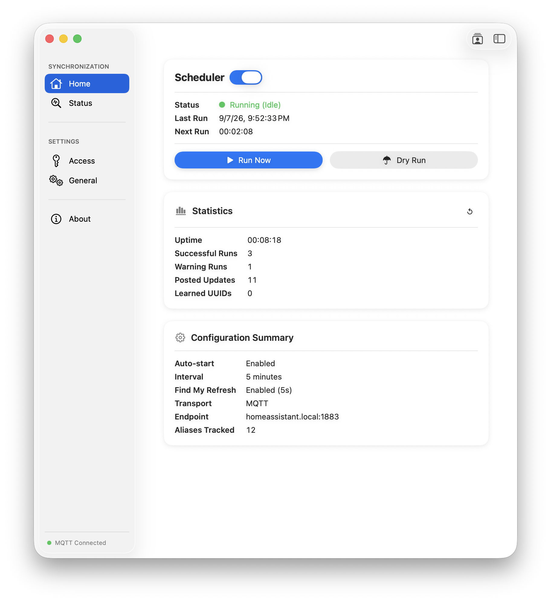
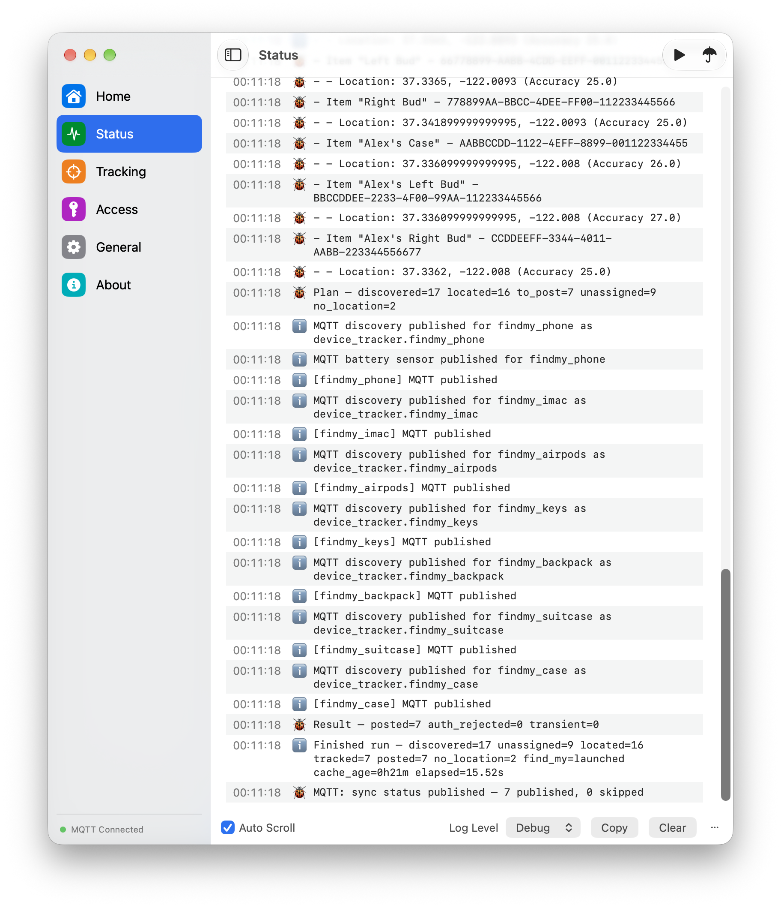
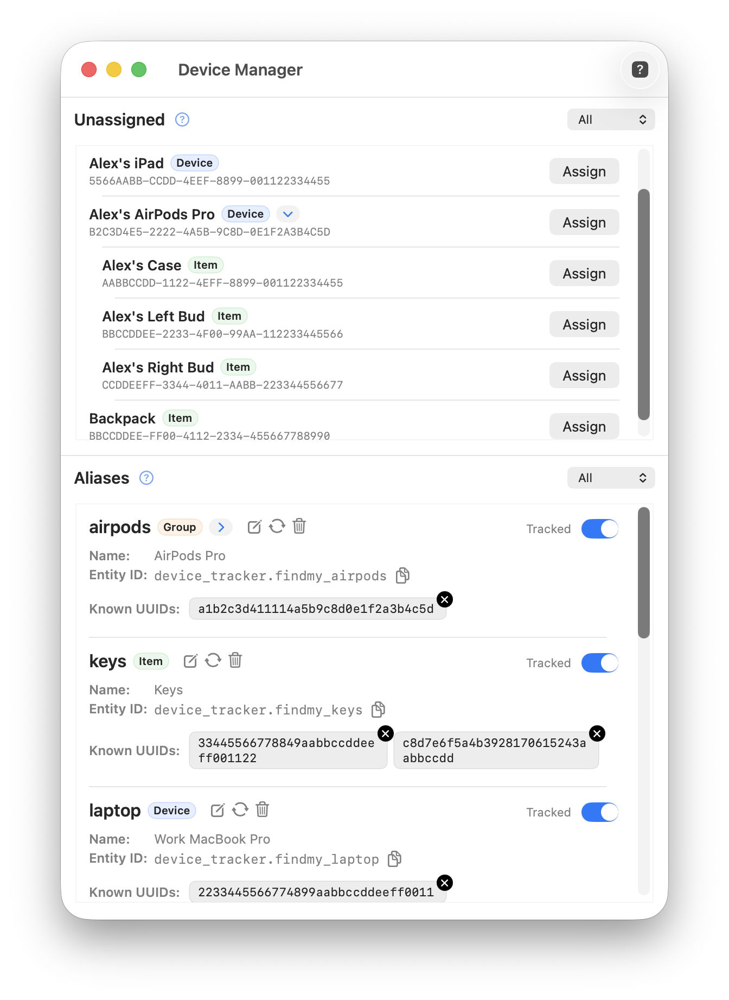
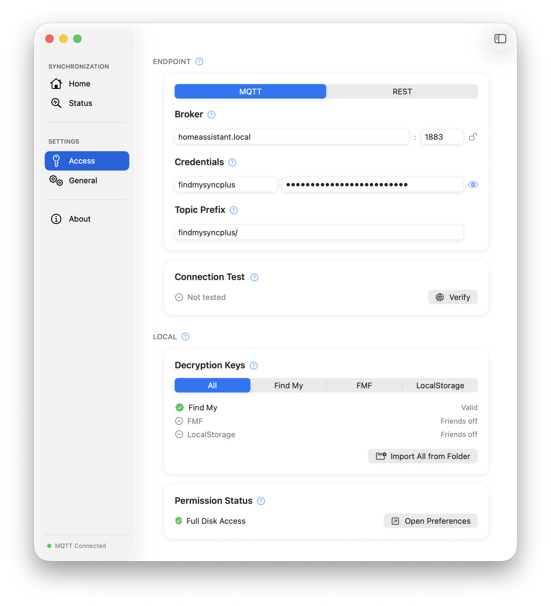
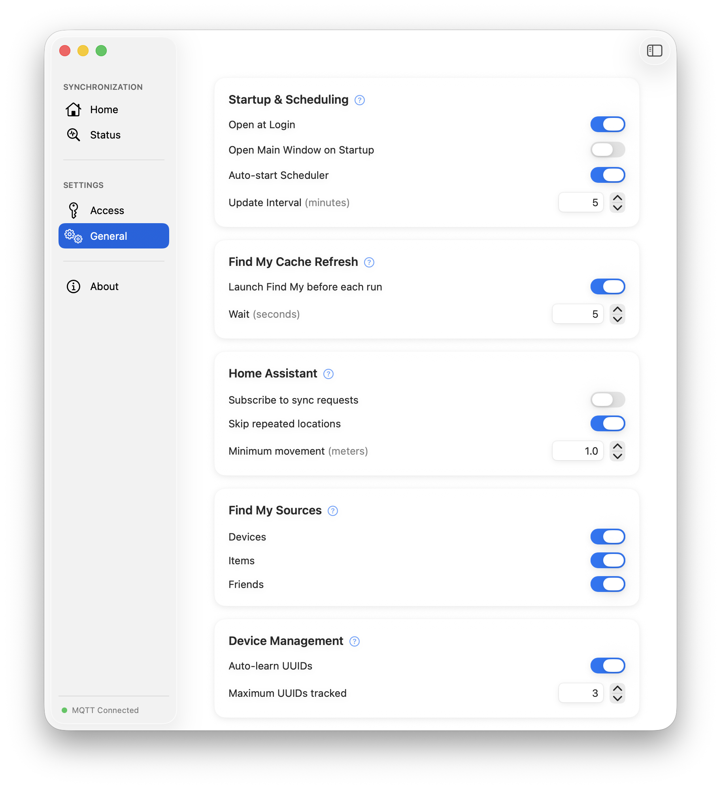
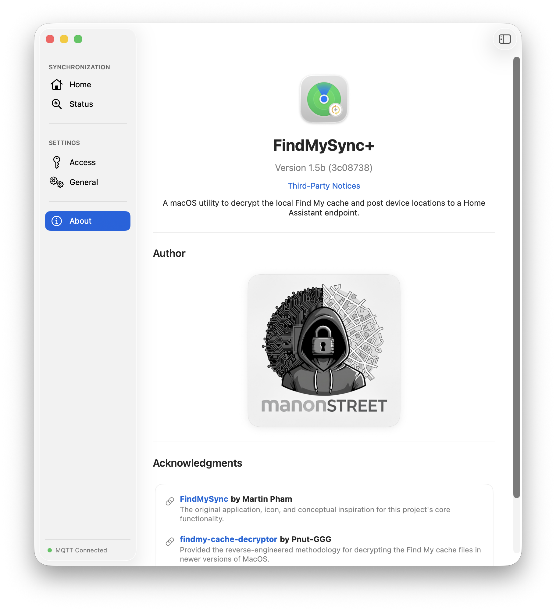

# FindMySyncPlus


> Publish Apple Find My locations to Home Assistant — devices, items, and friends — privately, locally, no third-party services.

FindMySyncPlus reads your encrypted Find My cache files, decrypts them, and posts location updates
directly to your Home Assistant instance on a configurable schedule. No cloud relay. No tracking
service. Your Find My data goes straight to your home network and nowhere else.

It tracks Devices (iPhones, Apple Watch), Items (AirTags), and Friends — including live friend
coordinates by decrypting `LocalStorage.db`, something no other tool supports. Supports both
**REST** (`device_tracker/see`) and **MQTT** (with HA auto-discovery and rich attributes) transports.
Rotating UUIDs are handled automatically, and all sensitive credentials are stored securely in the
macOS Keychain.

Based on [FindMySync](https://github.com/MartinPham/FindMySync) and the decryption research by
[Pnut-GGG](https://github.com/Pnut-GGG/findmy-cache-decryptor).

> If you're coming from FindMySync — this is the version that ***works on macOS 14.4 and later***. See [Migrating from FindMySync](#migrating-from-findmysync).

---

## Why FindMySyncPlus?

|  | FindMySyncPlus | FindMySync (original) | iCloud3 |
|--|:-:|:-:|:-:|
| macOS 14.4+ (encrypted caches) support | ✅ | ❌ | ➖ |
| AirTag / Items support | ✅ | ✅ | ❌ |
| Friend location tracking | ✅ | ❌ | ❌ |
| Auto-refresh Find My (no AppleScript) | ✅ | ❌ | ➖ |
| Auto-learn rotating UUIDs | ✅ | ❌ | ➖ |
| HA Mobile App on tracked devices | Not required | Not required | ⚠️ Recommended |
| Connects to Apple iCloud API | ➖ | ➖ | ✅ |
| Runs inside Home Assistant | ❌ Requires a Mac | ❌ Requires a Mac | ✅ |
| Initial setup complexity | 🟡 Moderate (key extraction) | 🟢 Low | 🔴 High |
| Ongoing configuration | 🟢 Low | 🟢 Low | 🔴 High |
| Update frequency | Configurable (≥1 min) | External AppleScript | Near real-time |

---

## Features

- Tracks **Devices** (iPhone, Apple Watch), **Items** (AirTags), and **Friends**
- **Two transport modes** — REST (`device_tracker/see`) or MQTT with Home Assistant auto-discovery
- **MQTT rich attributes** — altitude, speed, course, motion state, location labels via `json_attributes_topic`
- **Friend location tracking** — decrypts `LocalStorage.db` for live friend coordinates; family members already tracked via Devices are automatically deduplicated using Apple's universal person identifier (DSID)
- **Device Manager** — assign friendly aliases to devices, items, and friends; aliases become stable HA entity IDs even as UUIDs rotate
- **Grouped accessories** — AirPods Pro pairs (and similar) appear as a single Device Manager entry; sub-items (Case, Left Bud, Right Bud) can be revealed and aliased individually if needed. This grouping is within FindMySyncPlus — in Home Assistant every entity appears under a single `FindMySync+` device
- **Battery sensor** — devices that report a real battery level (iPhone, Apple Watch, Mac) get a `device_class: battery` sensor, so battery works with the battery card and low-battery blueprints. AirTags and third-party trackers report a small vendor-specific code rather than a percentage, so they get the raw value as an attribute instead of an invented one
- **Auto-learn UUIDs** — automatically re-maps devices when Apple rotates their identifier
- Configurable scheduler with selectable refresh interval and manual **Run Now** and **Dry Run** modes
- **Four log levels** (Error / Warn / Info / Debug) with per-run statistics — posted updates, warnings, learned UUIDs
- Optionally auto-launches Find My to refresh cache before each sync — no AppleScript required
- All credentials (encryption key, HA token) stored in the macOS **Keychain**
- Menu bar agent — runs silently in the background with open-at-login support
- Full Disk Access gating with clear in-app guidance when permission is missing

---

## Friend Location Tracking

FindMySyncPlus is the only tool that tracks friend locations from Apple Find My. Apple discontinued
the Find My Friends (FMF) API, and live friend coordinates are not available in the `.data` cache
files that other tools read. The only remaining source is `LocalStorage.db` — an encrypted SQLite
database owned by `findmylocateagent`.

FMS+ decrypts this database using the same AES-256 keystream XOR cipher that Apple's `libsqlite3`
codec uses internally, discovered by reverse-engineering the `sqliteCodecCCCrypto` function.

**Family member dedup & enrichment** — Family members appear in both `Devices.data` (as shared devices) and
`LocalStorage.db` (as friends). FMS+ automatically detects this overlap using Apple's universal
person identifier (DSID) and skips duplicates, so each family member is only tracked once. Rich
attributes from LocalStorage (altitude, speed, course, motion state) are merged onto the FMIP
device entry, giving family members the best of both sources.

**Requires macOS 15 or later.** macOS 14 does not store friend locations, so there is nothing to
process. The FMF and LocalStorage keys are not used there.

**Setup:** Import `LocalStorage.key` in the Access Settings tab (extracted alongside the other keys in Phase 1) — the Friends source auto-enables when the key is imported.

---

## Screenshots

<p>
  <a href="screenshots/home_view.png"></a>
  <a href="screenshots/status_view.png"></a>
  <a href="screenshots/device_manager.png"></a>
</p>
<p>
  <a href="screenshots/access_settings.png"></a>
  <a href="screenshots/general_settings.png"></a>
  <a href="screenshots/about_view.png"></a>
</p>

---

## Requirements

- macOS 14.4 (Sonoma) or later — 14.4 is where Apple began encrypting the Find My caches, which is what this app decrypts
- Friend locations require macOS 15 or later — on macOS 14 only the Find My key is needed
- A running Home Assistant instance — either the `device_tracker.see` REST API or an MQTT broker (e.g. Mosquitto add-on)
- Find My encryption keys extracted from Keychain (see Phase 1 below)

---

## Getting Started

### Phase 1 — Extract Keys

Extract your Find My encryption keys using
[findmy-key-extractor](https://github.com/manonstreet/findmy-key-extractor).
This is a one-time step — keys are stable across reboots. Requires temporarily disabling SIP + AMFI;
see the extractor README for the full procedure.

The extractor saves all three keys to a `keys/` folder:

| Key file | Enables |
|----------|---------|
| `keys/FMIPDataManager.bplist` | **Required** — device and item tracking (core feature) |
| `keys/FMFDataManager.bplist` | Friend metadata |
| `keys/LocalStorage.key` | Friend location tracking |

Import all three in the **Access** settings tab (Phase 3) — select the **All** tab under Decryption Keys and click **Import All from Folder**, then point it at the `keys/` directory.

### Phase 2 — Install

Download the latest `.dmg` from [Releases](../../releases), open it, and drag FindMySyncPlus to
your Applications folder. Right-click → Open the first time to bypass Gatekeeper.

Alternatively, clone the repo and build in Xcode with automatic signing enabled.

### Phase 3 — Configure

Launch the app and open the **Access** pane (the Home screen will show "Not Set" errors — click one):

1. **Choose transport mode** — MQTT is selected by default. Switch to REST if preferred.
2. **MQTT users:** Enter your broker host, port, username, and password. Set topic prefix if desired (default: `findmysyncplus/`). HA auto-discovery creates entities automatically — no `known_devices.yaml` needed
   **REST users:** Enter your HA `device_tracker.see` endpoint URL and Authorization header (include the `Bearer` prefix)
3. Click **Verify** to test the connection
4. Under **Decryption Keys**, select the **All** tab and click **Import All from Folder** — point it at the `keys/` directory from Phase 1
5. Click **Open Preferences** and grant Full Disk Access
6. Quit and relaunch the app

If prompted by Keychain, click **Always Allow**.

> **Building from source?** You do not need a paid Apple Developer account. A free Apple ID is enough —
> Xcode calls this a **Personal Team** and it signs macOS apps indefinitely for local use.
>
> 1. In Xcode, go to **Xcode → Settings → Accounts** and add your Apple ID — Xcode automatically creates a Personal Team and generates a signing certificate for you
> 2. Select the project in the navigator, open **Signing & Capabilities**, enable **Automatically manage signing**, and choose your Personal Team from the Team dropdown
> 3. Build and run — if Keychain prompts appear, click **Always Allow** once
>
> See [Choosing a Membership](https://developer.apple.com/support/compare-memberships/) for a full comparison of free vs paid Apple Developer accounts.

Under the **General** pane, recommended settings:
- Enable **Open at Login**
- Disable **Open Main Window on Startup** (runs as a menu bar agent)
- Enable **Auto-start Scheduler**
- Enable **Auto-learn UUIDs**

### Phase 4 — First Run & Device Manager

1. Open the **Status** pane and set log level to **Debug**
2. Click **Run Now** (▶) in the toolbar and review the logs — all discovered devices, items, and friends appear here
3. Open **Device Manager** and click **Assign** for each entry you want to track — friends appear with a purple **Friend** badge
4. Give each entry an alias — the Home Assistant entity will be `findmy_<alias>`
5. Return to the **Home** pane and enable the **Scheduler**

**REST users:** Optionally edit `known_devices.yaml` in Home Assistant to add friendly names:
```yaml
findmy_alias1:
  name: "Alice's AirTag"
  track: true
```

**MQTT users:** Entities are created automatically via HA auto-discovery — no `known_devices.yaml` needed. Rich attributes (altitude, speed, motion state, etc.) are available on each entity's `json_attributes`, and devices reporting a real battery level also get a separate `device_class: battery` sensor.

---

## Migrating from FindMySync

The original FindMySync names its Home Assistant entities after the device UUID — the keys in `known_devices.yaml` look like this:

```yaml
findmy_a1b2c3d4e5f6478899aabbccddeeff00:
  name: "Backpack"
  mac: FINDMY_A1B2C3D4-E5F6-4788-99AA-BBCCDDEEFF00
  track: true
```

FindMySyncPlus names entities after the alias you choose, as `findmy_<alias>`. That leaves two options.

**Keep your existing entity IDs.** Set each alias to the device's UUID with the hyphens removed — the UUID is shown in the Assign dialog and can be copied from there. `findmy_<that hex>` will match what you have now, and existing automations keep working untouched.

Delete the old entities in Home Assistant first by commenting out or deleting the entries in your `known_devices.yaml` and restarting. Home Assistant won't reuse an entity ID that is still in use, and skipping this leaves you with `_2` suffixes.

**Or use readable aliases and rename once.** The alias exists as an abstraction over the UUID, because Apple rotates the UUIDs of its own devices — iPhones, Apple Watches and AirTags all get new ones periodically. FindMySyncPlus notices and re-links them to the alias automatically, so tracking survives. An entity ID pinned to a UUID does not: when the UUID changes, the old entity stops updating.

I haven't tested whether third-party trackers rotate their UUIDs, so if that's all you use, the first option may work fine — but I can't promise it.

The trade-off: keeping your IDs means no changes on the Home Assistant side, but leaves you exposed if a UUID ever rotates. Fresh aliases mean renaming entities once, and staying stable afterwards.

**Note:** `icon` and `picture` from `known_devices.yaml` aren't supported by FindMySyncPlus. Set them on the entity in Home Assistant instead.

---

## A Note on AI Co-creation

This project was my first experience building software collaboratively with AI — using ChatGPT,
Gemini, and Claude as thinking partners throughout the process. It started as a learning exercise
and grew into a working tool I run daily. Later versions — including friend location tracking and
the `LocalStorage.db` cipher reverse-engineering — were built exclusively with Claude. The code
reflects that journey.

---

## Acknowledgements

- [FindMySync](https://github.com/MartinPham/FindMySync) by Martin Pham — the original project this is based on
- [findmy-cache-decryptor](https://github.com/Pnut-GGG/findmy-cache-decryptor) by Pnut-GGG — reverse-engineered the Find My `.data` file encryption
- `LocalStorage.db` cipher — reverse-engineered from Apple's `sqliteCodecCCCrypto` in `libsqlite3.dylib` via `lldb` disassembly, with [Claude](https://claude.ai)
- [findmy-key-extractor](https://github.com/manonstreet/findmy-key-extractor) — extracts all 3 Find My encryption keys required for setup
- [Ink](https://github.com/JohnSundell/Ink) — MIT-licensed Markdown parser used in-app
- [FollowMyFriends](https://github.com/bytePatrol/FollowMyFriends) — reference for MQTT transport pattern
- [CocoaMQTT](https://github.com/emqx/CocoaMQTT) — MIT-licensed MQTT client for Swift
